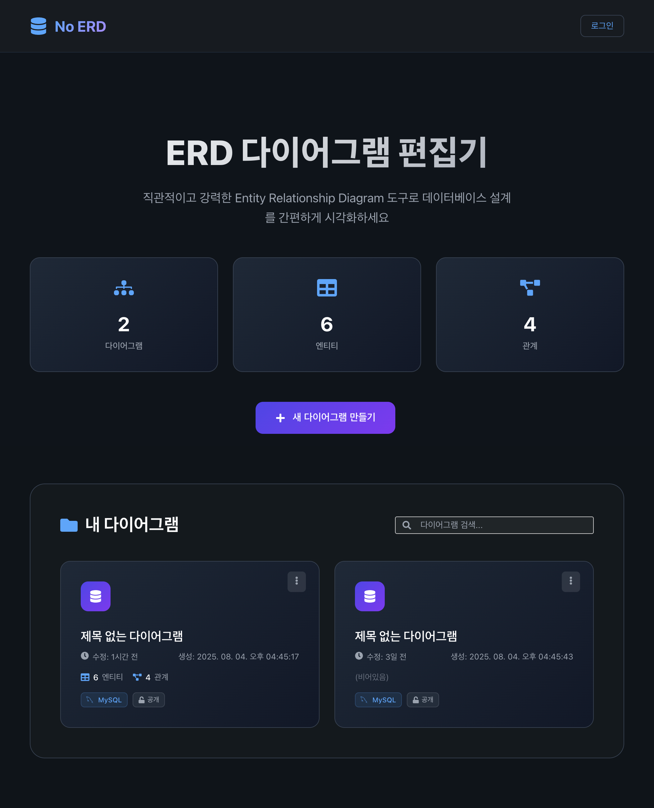
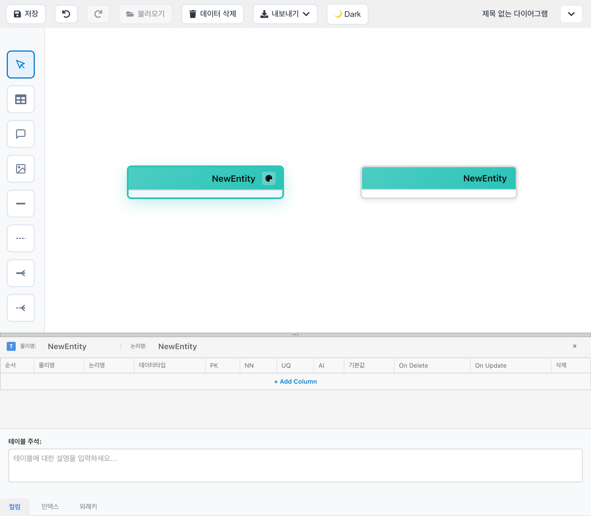
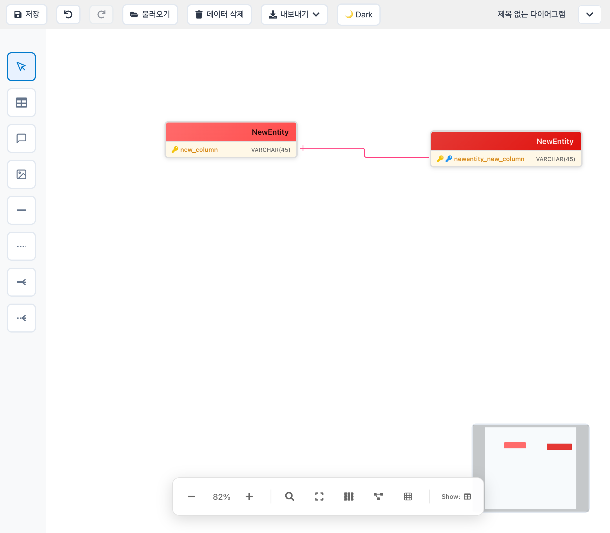
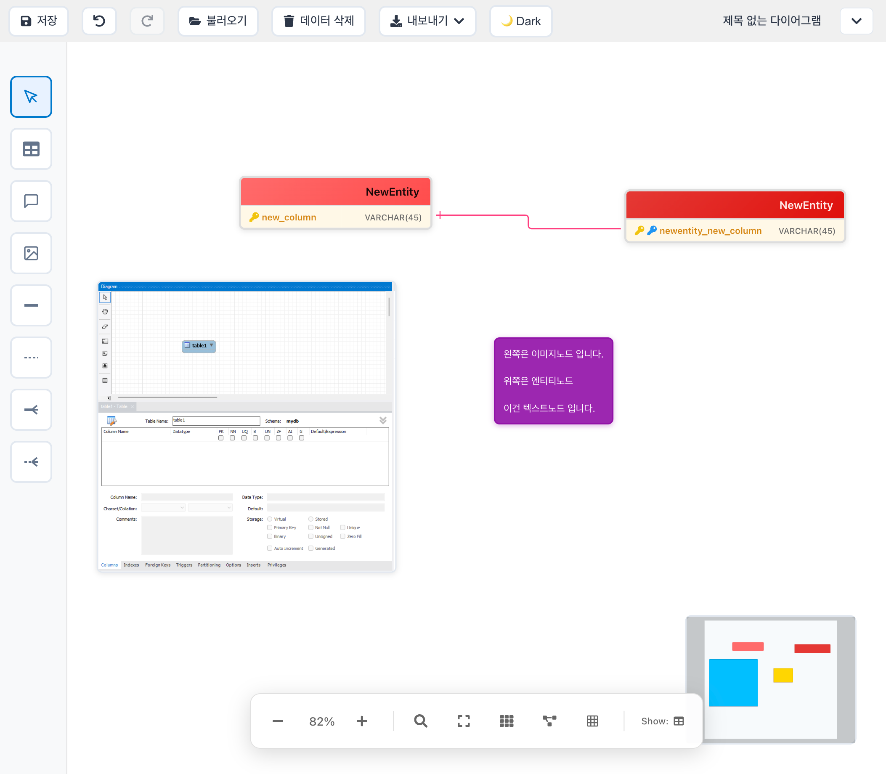
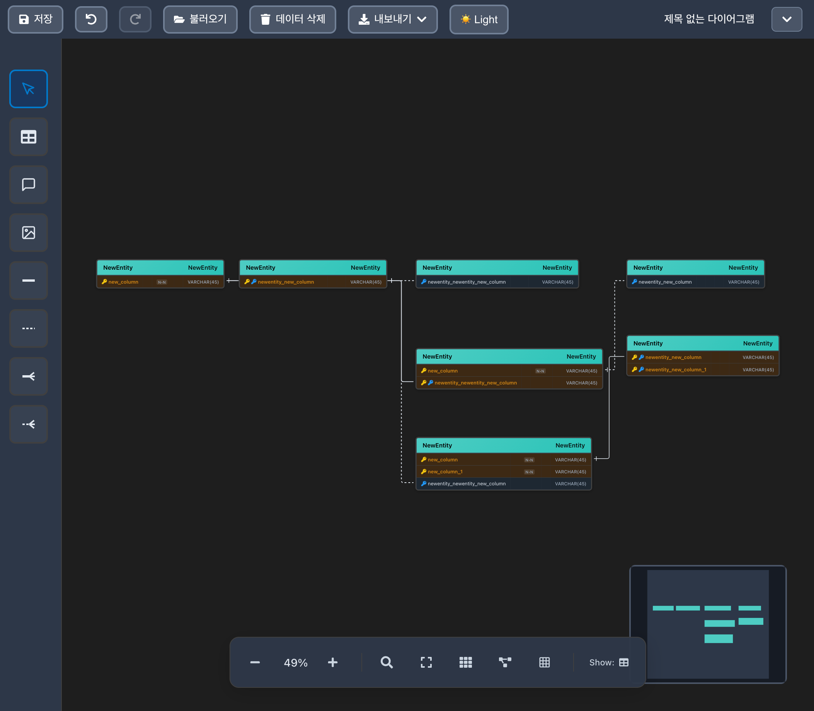
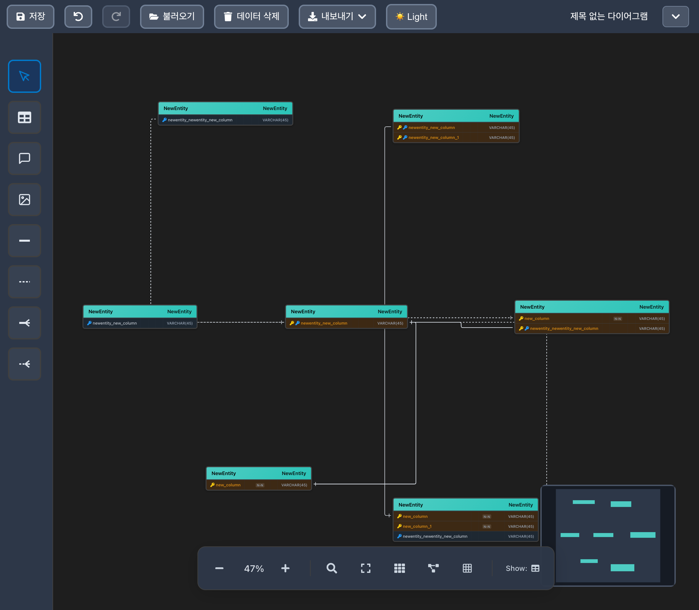
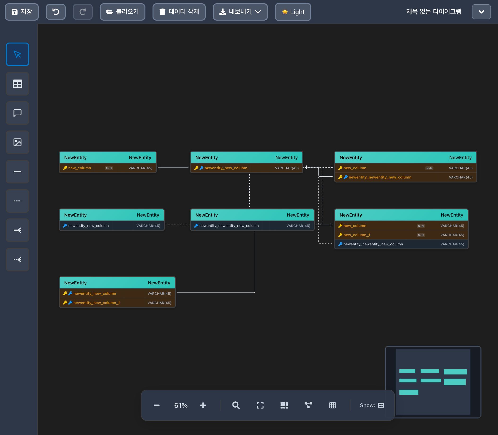
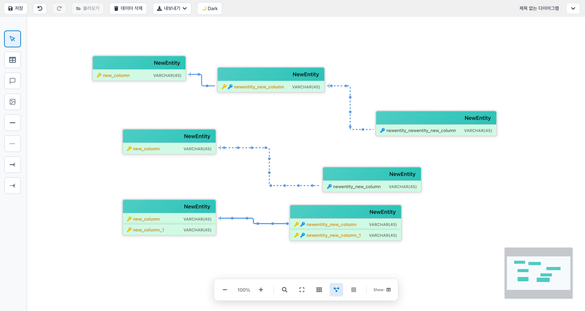
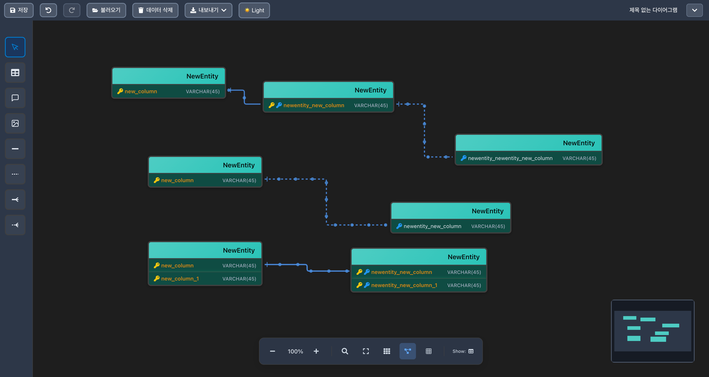
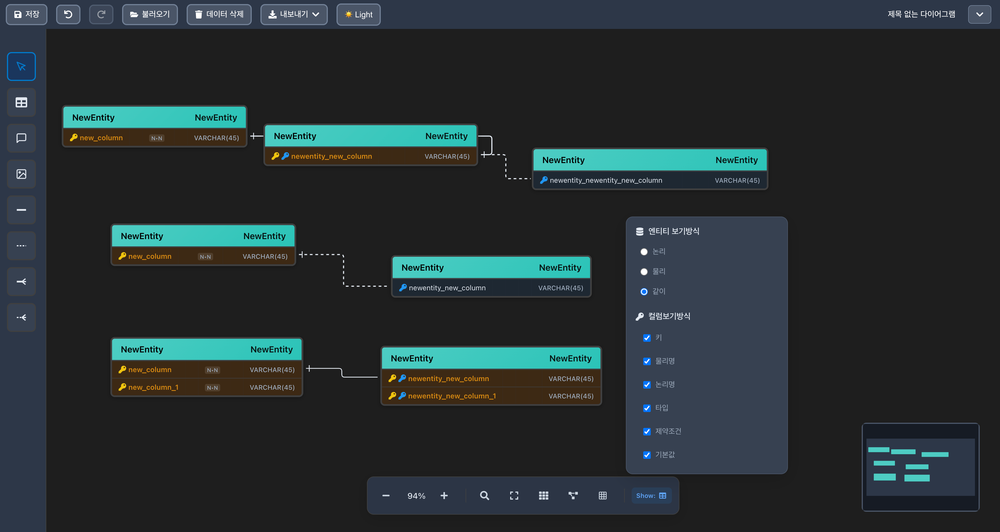

# ERD Editor

웹 기반 Entity Relationship Diagram 편집기입니다.
  

## 목차
  - [프로젝트 개요](#프로젝트-개요)
  - [주요 기능](#주요-기능)
  - [사용 기술](#사용-기술)
  - [개발 환경](#개발-환경)
  - [화면](#화면)
  

## 프로젝트 개요
- 데이터베이스 설계 과정에서 기존 도구들의 한계를 느끼게 되었습니다. MySQL Workbench나 ERDCloud 같은 도구들은 설치가 필요하거나 웹에서도 복잡한 인터페이스를 가지고 있어서, 간단하고 직관적인 웹 기반 ERD 편집기를 만들어보고 싶었습니다.
  
- React Flow의 강력한 다이어그램 편집 기능을 활용하면 드래그 앤 드롭으로 쉽게 엔티티를 배치하고 관계를 정의할 수 있을 것 같았습니다. 이 프로젝트는 React와 TypeScript를 기반으로 구축했으며, 웹 브라우저에서 바로 사용할 수 있는 완전한 ERD 편집기를 만들었습니다.
  

## 🔗 URL
- **Live Demo**: https://erd-dusky.vercel.app/
  

## 주요 기능

### 다이어그램 편집 및 시각화
- **직관적인 드래그 앤 드롭**: 마우스로 엔티티를 자유롭게 배치하고 관계를 설정
- **다양한 노드 타입**: Entity, Comment, Text, Image 노드로 풍부한 다이어그램 구성
- **스마트 관계선**: Identifying/Non-identifying 관계를 시각적으로 구분하여 표시
- **복합키 지원**: 다중 컬럼 기본키 및 외래키로 복잡한 데이터 모델링 지원
- **실시간 미리보기**: 변경사항이 즉시 반영되는 실시간 편집 환경

### 이미지 노드 고급 기능
- **다양한 이미지 소스**: 로컬 파일 업로드 및 URL 입력 지원
- **동적 리사이징**: NodeResizer로 이미지 크기를 실시간으로 조정
- **스마트 검증**: 이미지 파일 타입 및 URL 유효성 자동 검사
- **최적화된 렌더링**: 고품질 이미지 표시 및 성능 최적화

### 사용자 경험 최적화
- **테마 시스템**: 라이트/다크 모드로 사용자 선호도에 맞는 인터페이스
- **데이터 저장**: 로컬 스토리지 저장으로 작업 내용 보호
- **히스토리 관리**: Undo/Redo 기능으로 실수 방지 (Ctrl+Z/Ctrl+Y)
- **강력한 검색**: 노드명, 컬럼명, 데이터 타입을 통한 빠른 요소 검색
- **데스크톱 최적화**: 정밀한 다이어그램 편집을 위한 데스크톱 인터페이스

### 시각적 커스터마이징
- **개별 색상 관리**: 노드별 개별 색상 설정으로 시각적 구분 강화
- **정밀 정렬 도구**: 수평/수직 정렬 및 스냅 가이드로 깔끔한 레이아웃
- **뷰 전환**: 논리적/물리적 뷰로 다양한 관점에서 다이어그램 확인
- **표시 옵션**: 기본키, 외래키, 데이터 타입 표시를 선택적으로 제어
- **그리드 시스템**: 정렬 가이드로 전문적인 다이어그램 구성

### 고급 편집 기능
- **복사/붙여넣기**: 노드와 관계의 복제 및 재사용
- **그룹 선택**: 다중 선택으로 일괄 편집 작업
- **키보드 단축키**: 효율적인 작업을 위한 다양한 단축키 지원
- **내보내기 기능**: 다이어그램을 이미지로 저장하여 문서화
- **워크스페이스 관리**: 여러 프로젝트를 탭으로 관리

### 데이터베이스 지원
- **MySQL 타입 지원**: 완전한 MySQL 데이터 타입 시스템
- **제약조건 관리**: NOT NULL, UNIQUE, DEFAULT 등 다양한 제약조건
- **인덱스 설정**: 성능 최적화를 위한 인덱스 관리
- **코멘트 시스템**: 테이블 및 컬럼별 상세 설명 추가
  

## 사용 기술
- **React 19.1.0** - 사용자 인터페이스 구축
- **TypeScript 5.8.3** - 타입 안전성과 개발 생산성 향상
- **React Flow 11.11.4** - 다이어그램 편집 및 노드/엣지 관리
- **Zustand 5.0.6** - 경량 상태 관리 라이브러리
- **Styled Components 6.1.19** - CSS-in-JS 스타일링
- **React Router DOM 7.7.1** - 클라이언트 사이드 라우팅
- **React Toastify 11.0.5** - 사용자 알림 시스템
- **React Dropzone 14.3.8** - 파일 업로드 기능
- **React Color 2.19.3** - 색상 선택기 컴포넌트
- **React Icons 5.5.0** - 아이콘 라이브러리
- **Vite 7.0.5** - 빠른 개발 서버 및 빌드 도구
- **HTML-to-Image 1.11.13** - 다이어그램 이미지 내보내기
- **Lodash Throttle 4.1.1** - 성능 최적화를 위한 함수 스로틀링
  

## 개발 환경
- **CPU**: Apple M1 Pro
- **RAM**: 16GB
- **OS**: macOS 14.5.0
- **Node.js**: 18.0.0 이상
  

## 화면

### 메인 화면

### 엔티티 편집

  
  
  

 

### 배치

  
  
  

 

### 관계 설정

### 다크 테마
 

### 보기 방식
 